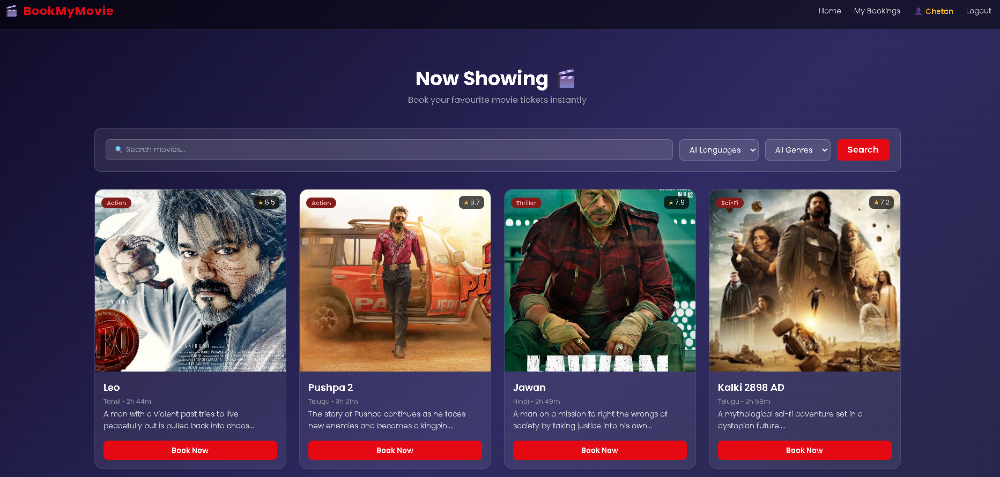
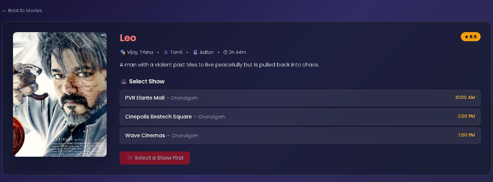
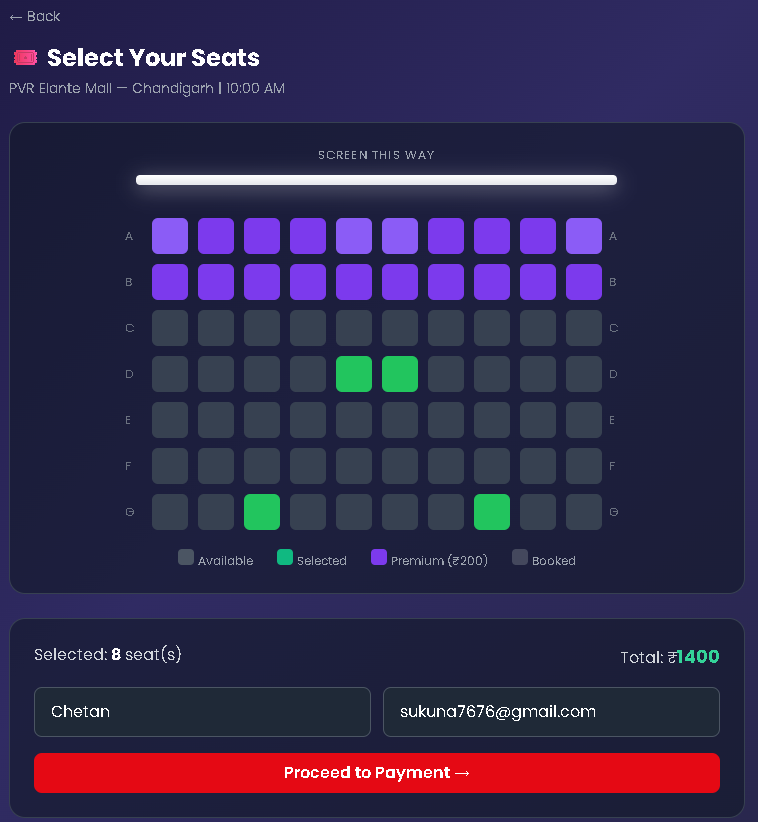
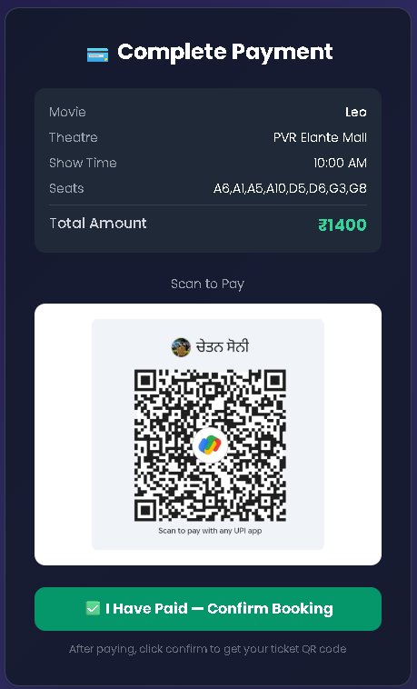
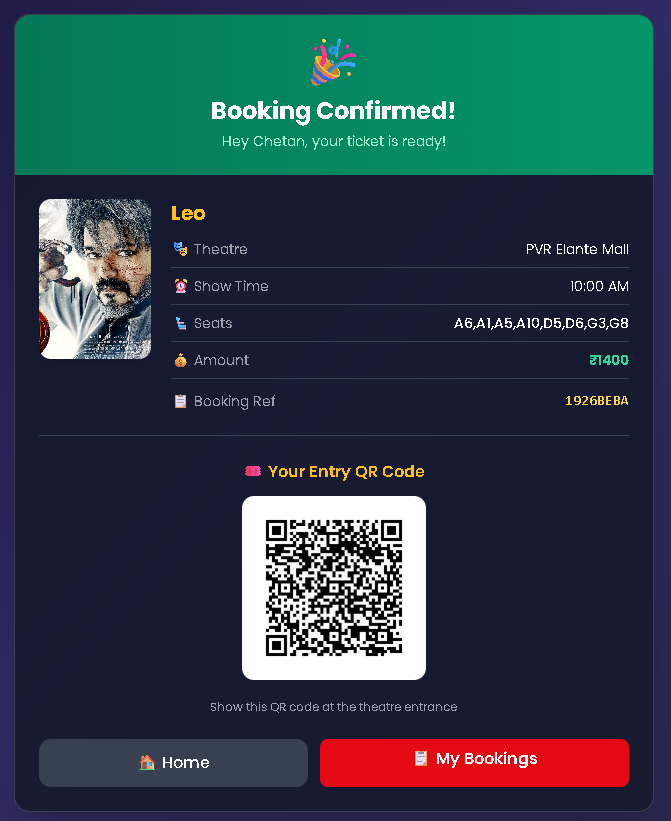
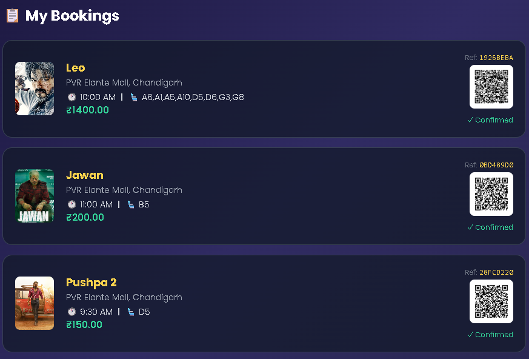

# 🎬 BookMyMovie — Movie Ticket Booking System

A full-stack web application for booking movie tickets online, built with Python Flask and MySQL.

[](https://python.org)
[](https://flask.palletsprojects.com)
[](https://mysql.com)
[](https://tailwindcss.com)
[](https://movie-ticket-booking-system-engm.onrender.com)

---

## 📸 Screenshots

### 🏠 Homepage


### 🎥 Movie Detail


### 🪑 Seat Selection


### 💳 Payment Page


### 🎟️ Booking Confirmation


### 📋 My Bookings


---

## ✨ Features

- 🔐 **User Authentication** — Register & login with secure SHA256 password hashing
- 🎥 **Movie Browsing** — Browse movies with search, language & genre filters
- 🪑 **Interactive Seat Selection** — Real-time seat availability with Premium & Standard seats
- 💳 **UPI Payment** — Integrated QR code payment system
- 🎟️ **QR Ticket Generation** — Auto-generated unique QR ticket after booking
- 📋 **My Bookings** — View all past bookings with QR codes
- ⚙️ **Admin Dashboard** — Manage movies, view all bookings & track revenue

---

## 🛠️ Tech Stack

| Layer | Technology |
|---|---|
| Backend | Python 3.8+, Flask |
| Database | MySQL 8.0 |
| Frontend | HTML5, TailwindCSS, JavaScript |
| Authentication | Flask Sessions + SHA256 Hashing |
| QR Code | qrcode + Pillow |
| Environment | python-dotenv |

---

## 🚀 Setup Instructions

### 1. Clone the repository
```bash
git clone https://github.com/Chetansoni1/movie-ticket-booking-system.git
cd movie-ticket-booking-system
```

### 2. Create virtual environment
```bash
python -m venv venv

# Windows
venv\Scripts\activate

# Mac/Linux
source venv/bin/activate
```

### 3. Install dependencies
```bash
pip install -r requirements.txt
```

### 4. Configure environment
Create a `.env` file in the root folder:
```env
DB_HOST=localhost
DB_USER=root
DB_PASSWORD=your_mysql_password
DB_NAME=movie_booking
SECRET_KEY=your_secret_key
ADMIN_PASSWORD=admin123
```

### 5. Setup the database
```bash
mysql -u root -p
source path/to/db_setup.sql
```

### 6. Run the application
```bash
python app.py
```

Visit **https://movie-ticket-booking-system-engm.onrender.com** 🎉

---

## 📁 Project Structure

```
movie-ticket-booking-system/
├── app.py                  # Flask routes & business logic
├── config.py               # MySQL database connection
├── db_setup.sql            # Database schema + seed data
├── requirements.txt        # Python dependencies
├── .env                    # Environment variables (not pushed)
├── .gitignore              # Git ignore rules
├── static/
│   ├── css/styles.css      # Custom styles
│   └── images/             # Movie posters + generated QR tickets
├── templates/
│   ├── base.html           # Base layout with navbar
│   ├── index.html          # Homepage with search & filters
│   ├── login.html          # User login page
│   ├── register.html       # User registration page
│   ├── movie_detail.html   # Movie details & show selection
│   ├── book_ticket.html    # Interactive seat selection
│   ├── payment.html        # UPI QR payment page
│   ├── success.html        # Booking confirmation + QR ticket
│   ├── my_bookings.html    # User booking history
│   ├── admin_login.html    # Admin login page
│   └── admin_dashboard.html # Admin panel
└── screenshots/            # Project screenshots for README
```

---

## 🔑 Access

| Role | URL | Credentials |
|---|---|---|
| User | http://127.0.0.1:5000/register | Register yourself |
| Admin | http://127.0.0.1:5000/admin | Password: admin123 |

---

## 📌 Pages Overview

| Page | URL |
|---|---|
| 🏠 Home | `/` |
| 🔐 Login | `/login` |
| 📝 Register | `/register` |
| 🎥 Movie Detail | `/movie/<id>` |
| 🪑 Book Tickets | `/book?show_id=<id>` |
| 📋 My Bookings | `/my_bookings` |
| ⚙️ Admin Panel | `/admin` |


